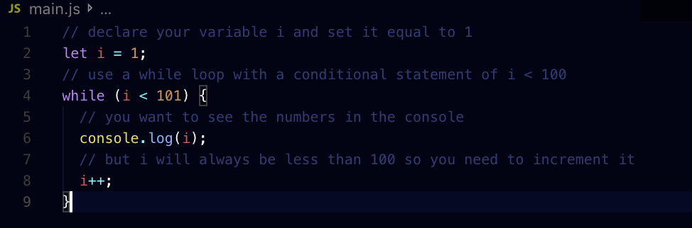
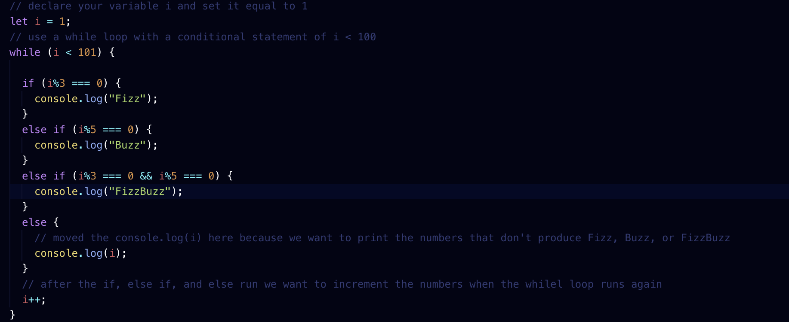
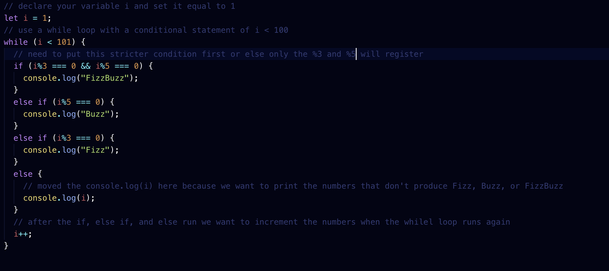
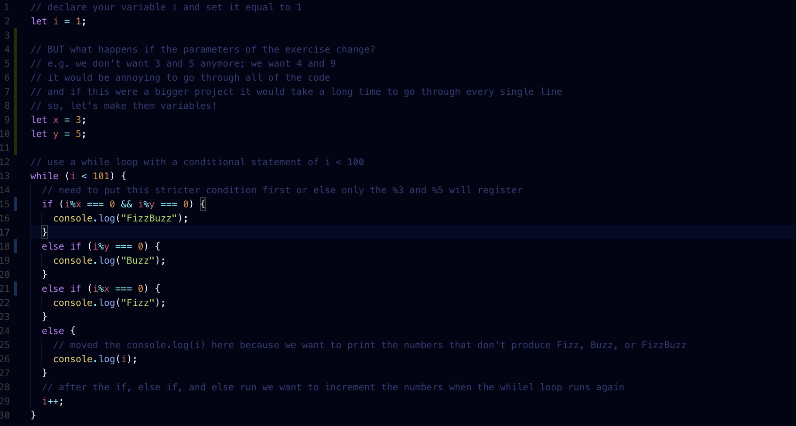

# fizzbuzz
The fizzbuzz exercise!
## What is it?
FizzBuzz is a simple programming task.
- Write a program that prints the numbers from 1 to 100.
- But for mulitples of three print "Fizz" instead of the number
- For multiples of five print "Buzz"
- For numbers which are multiples of both three and five print "FizzBuzz"

## DRY
Remember to be dry when doing FizzBuzz

## I will be doing this in the console, so please look at the gifs below!
Step 1: Set up your JS file; get all 1-100 showing in your console

Here you can see that all of the number 1 to 100 are showing in the console

Step 2: Use if/else if/ else statement to work through conditional statements

Here you can see that all of the words 'Fizz' and 'Buzz' are showing up, but not 'FizzBuzz'

Step 3: Reorganize your statements! the most strict conditional needs to go first!

Step 3A: Here is the console showing that after reorganizing FizzBuzz is showing

Step 5: Declare variables to hold the values of 3 and 5; this is just a 'if you ever need to change the values in the future' step; also, not hard codinging the values in line with the code, this will make changing the code more annoying and time consuming to fix

