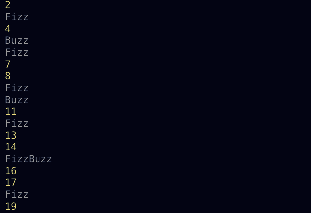

# fizzbuzz
The fizzbuzz exercise!
## What is it?
FizzBuzz is a simple programming task.
- Write a program that prints the numbers from 1 to 100.
- But for mulitples of three print "Fizz" instead of the number
- For multiples of five print "Buzz"
- For numbers which are multiples of both three and five print "FizzBuzz"

## DRY
Remember to be dry when doing FizzBuzz

## I will be doing this in the console, so please look at the gifs below!
Step 1: Set up your JS file

Step 2: Use if/else if/ else statement to work through conditional statements

Step 3: Reorganize your statements! the most strict conditional needs to go first!

Step 4: 

Step 5: 

